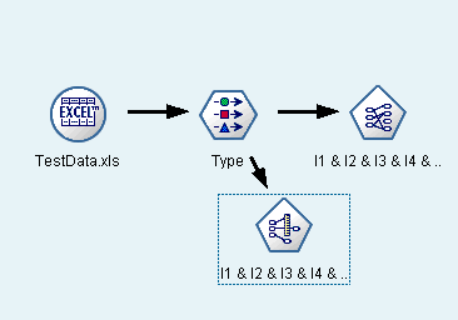
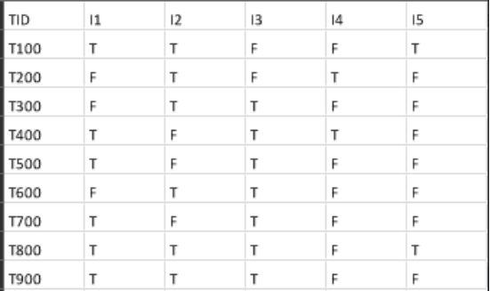
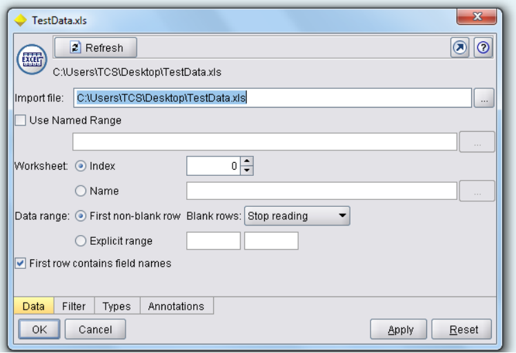
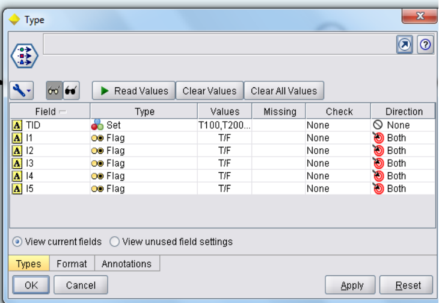
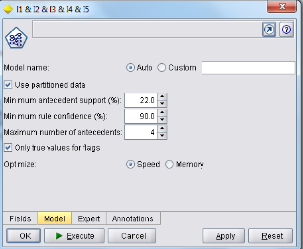
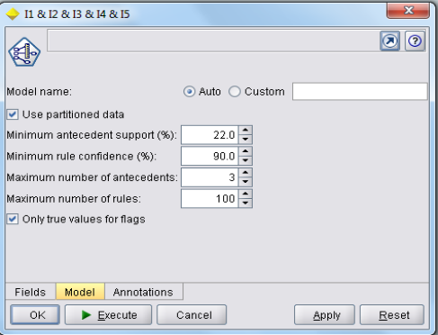

# Experiment 1: Comparing GRI and Apriori

## Task
**Using BASKETS1N Compare the GRI and Apriori with support 22% and confidence 90% usage (prepare a sample data set in a spreadsheet)**

## Solution

### Expected Output

### Input Data Set
An Excel file is prepared as shown below:

### Output Data Set
The below outputs show that there is no difference in rules generated from the Apriori and GRI (Generalized Rule Induction), but the order is changed. In Apriori, first low-level frequent item sets rules are generated and subsequently the next level frequent itemset rules. Whereas in GRI, the rules are generated on Items i.e. first largest rule then smallest rule size for one item, then the same for subsequent items.

### Procedure
The following are the nodes used for this exercise with respective settings.

### Settings for Apriori

### Settings for GRI
