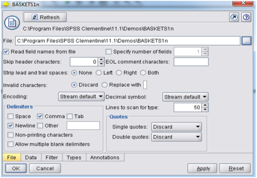
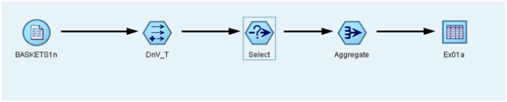
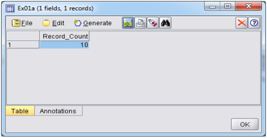
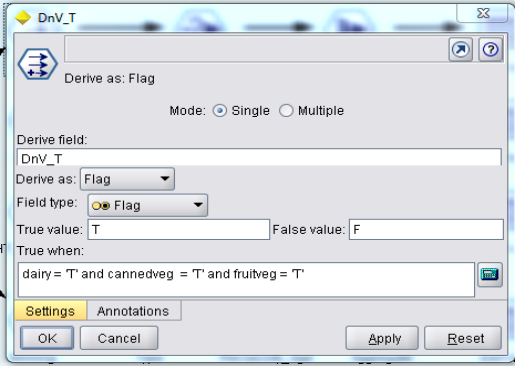
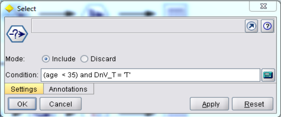
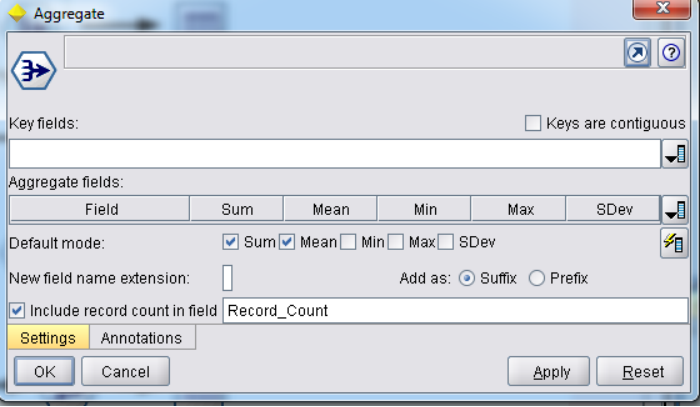
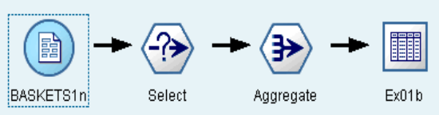
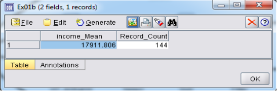
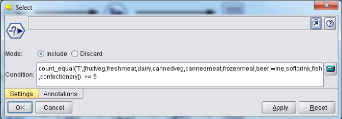
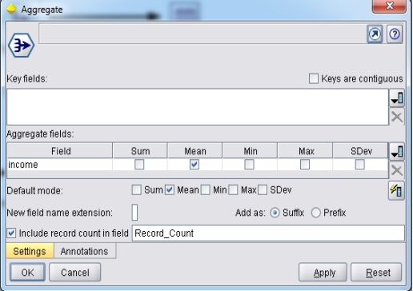

## Experiment 5

### Using BASKETS1n Dataset

#### 5.a) Customer age < 35 and count the customers who buy dairy and VEG products

**Input data set:** BASKETS1n

**Expected Output:**

**Output Dataset:**

**Procedure:**

1. Specify the name of the file. You can enter a filename or click the ellipsis button (...) to select a file. The file path is shown once you have selected a file, and its contents are displayed with delimiters in the panel below it.
2. Select `var.file` from sources then go to `C:\Program Files (x86)\SPSS Clementine\11.1\Demos\BASKETS1n` to get the baskets in the file.
3. Go to field options and select `Derive flag` and give the condition as `dairy = 'T'` and `cannedveg = 'T'` and `fruitveg = 'T'` and click OK. Based on the conditions, the truth values are shown and records are selected.

    

4. Go to options, search for `Select`, and give the condition as `[(age < 35) and DnV_T = 'T']`.

    

5. If both conditions are true, it counts the number of records.
6. Select the `Aggregate` operation to retrieve the sum and max of the records.

    

7. Select the output table and connect it with the aggregator.
8. Right-click on the output table and execute it.
9. Click on run, and the output will be displayed.

#### 5.b) Find the AVG income of customers who buy at least 5 products

**Expected Output:**

**Output Dataset:**

**Procedure:**

1. Specify the name of the file. You can enter a filename or click the ellipsis button (...) to select a file. The file path is shown once you have selected a file, and its contents are displayed with delimiters in the panel below it.
2. Select `var.file` from sources then go to `C:\Program Files (x86)\SPSS Clementine\11.1\Demos\BASKETS1n` to get the baskets in the file.
3. Go to options, search for `Select`, and give the condition as shown in the figure.

    

4. If the condition is true, it counts the number of records.
5. Select the `Aggregate` operation to retrieve `income_Mean` and count of the records.

    

6. Select the output table and connect it with the aggregator.
7. Right-click on the output table and execute it.
8. Click on run, and the output will be displayed.