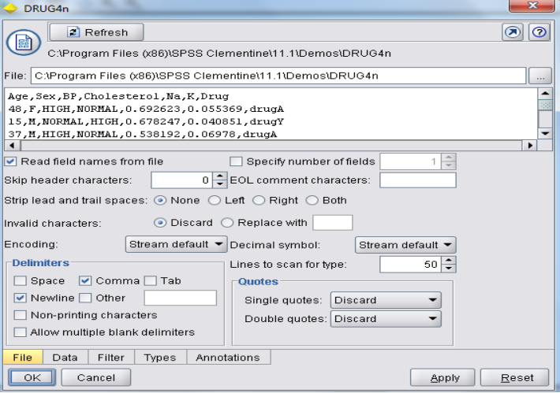
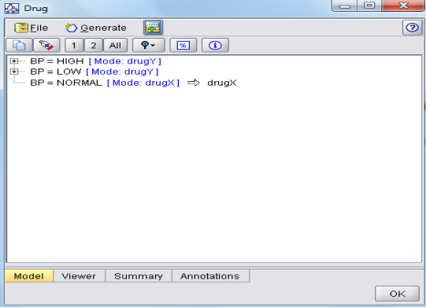

# Experiments: 2, 3, 4

## Experiment 2
**Determine the Drugs importance with respect to Age, Cholesterol, and BP using C 5.0.**

## Experiment 3
**Predict the accuracy of the test data set using Neural Net model using a Case Study of Botanical data set.**

## Experiment 4
**Compare the C 5.0 and Neural Net using the sample data.**

## Solution

### Expected Output

### Input Data Set

### Output Data Set

#### Output of Neural Net Model

#### Output of C5.0 Model

#### Output of C5.0 Model Viewer (Tree Format)

### Comparison
**Attribute Importance:**

- **Neural Net Model:** 
    -

Settings for C5.0 Model

Settings for Neural Net Model

